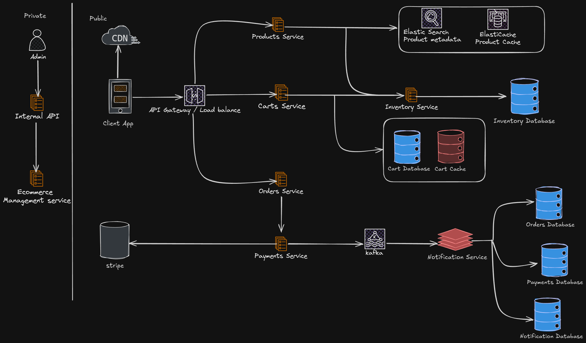

# Ecommerce Platform System

Build a scalable e-commerce platform using microservices architecture and Docker. The platform will handle various aspects of an online store, such as product catalog management, user authentication, shopping cart, payment processing, and order management. Each of these features will be implemented as separate microservices, allowing for independent development, deployment, and scaling.

## Step 1 - Understand the Problem and Establish Design Scope

Let's get started by defining the requirements

### Non-Functional Requirements

- Scalability: The system should be able to handle a large number of users and transactions.
- Availability: The system should be available 24/7.
- Performance: The system should be able to handle a large number of requests per second.
- Security: The system should be secure and protect user data.
- Maintainability: The system should be easy to maintain and update.
- Fault Tolerance: The system should be able to handle failures in individual services.

### Functional Requirements

- User Management: Users should be able to register, login, logout and manage their profiles.
- Product Management: Admins should be able to add, update, delete and view products.
- Shopping Cart: Users should be able to add, update, delete and view items in their cart.
- Order Management: Users should be able to create, view, update and delete orders.
- Payment Processing: Users should be able to pay for their orders.
- Notification Management: Users should be able to receive notifications about their orders.
- Inventory Management: Admins should be able to add, update, delete and view inventory.
- Search and Filtering: Users should be able to search and filter products.
- Reviews and Ratings: Users should be able to leave reviews and ratings for products.
- Wishlist Management: Users should be able to add, update, delete and view items in their wishlist.

### Back-of-the-envelope Estimation

- Assumption: 10M daily active users, with peak traffic 2x average.
- Traffic Breakdown: Mostly browsing/searching (80%), adding to cart (10%), checking out (5%), and admin (5%).
- Calculations:
  - 10M users/day \* 10 page views/user = 100M views/day
  - 100M / (24 \* 3600) = 1150 requests/second
  - 1150 \* 2 = 2300 requests/second

### Storage Requirements

- Assumption: 10M users, 100M products, 1M orders/day, 1-year retention.
- Calculation:
  - Users: 10M \* 1KB/user = 10GB
  - Products: 100M \* 10KB/product = 1TB
  - Orders: 1M/day _ 5KB/order _ 365 days = 1.8TB
  - Total: 10GB + 1TB + 1.8TB = 2.9TB

## Step 2 - High-Level Design and Api Design

### Data model

#### Users table (for now is in a sql database but will be moved to a nosql database)

| Column Name | Data Type    | Description |
| ----------- | ------------ | ----------- |
| id          | int          | Primary key |
| first_name  | varchar(50)  | First name  |
| last_name   | varchar(50)  | Last name   |
| username    | varchar(50)  | Username    |
| email       | varchar(100) | Email       |
| password    | varchar(100) | Password    |
| created_at  | timestamp    | Created at  |
| updated_at  | timestamp    | Updated at  |

#### Products table

| Column Name | Data Type    | Description          |
| ----------- | ------------ | -------------------- |
| id          | int          | Primary key          |
| name        | varchar(100) | Name                 |
| description | varchar(255) | Description          |
| image_url   | varchar(255) | Image url            |
| categoryId  | int          | Category id          |
| status      | boolean      | Status (true, false) |
| price       | decimal      | Price                |
| created_at  | timestamp    | Created at           |
| updated_at  | timestamp    | Updated at           |

#### Categories table

| Column Name | Data Type    | Description |
| ----------- | ------------ | ----------- |
| id          | int          | Primary key |
| name        | varchar(100) | Name        |
| description | varchar(255) | Description |
| created_at  | timestamp    | Created at  |
| updated_at  | timestamp    | Updated at  |

#### Inventory table

| Column Name | Data Type | Description |
| ----------- | --------- | ----------- |
| id          | int       | Primary key |
| product_id  | int       | Product id  |
| quantity    | int       | Quantity    |
| created_at  | timestamp | Created at  |
| updated_at  | timestamp | Updated at  |

#### Orders table

| Column Name  | Data Type   | Description                                                 |
| ------------ | ----------- | ----------------------------------------------------------- |
| id           | int         | Primary Key                                                 |
| user_id      | int         | User id                                                     |
| status       | varchar(50) | Status (pending, processing, shipped, delivered, cancelled) |
| total_amount | decimal     | Total amount                                                |
| created_at   | timestamp   | Created at                                                  |
| updated_at   | timestamp   | Updated at                                                  |

#### Order items table

| Column Name | Data Type | Description |
| ----------- | --------- | ----------- |
| id          | int       | Primary key |
| order_id    | int       | Order id    |
| product_id  | int       | Product id  |
| quantity    | int       | Quantity    |
| price       | decimal   | Price       |
| created_at  | timestamp | Created at  |
| updated_at  | timestamp | Updated at  |

#### Payments table

| Column Name    | Data Type   | Description                                                |
| -------------- | ----------- | ---------------------------------------------------------- |
| id             | int         | Primary key                                                |
| order_id       | int         | Order id                                                   |
| payment_method | varchar(50) | Payment method                                             |
| status         | varchar(50) | Current status of the payment (pending, succeeded, failed) |
| amount         | decimal     | Amount                                                     |
| created_at     | timestamp   | Created at                                                 |
| updated_at     | timestamp   | Updated at                                                 |

#### Carts table (pivot table)

| Column Name | Data Type | Description |
| ----------- | --------- | ----------- |
| id          | int       | Primary key |
| user_id     | int       | User id     |
| created_at  | timestamp | Created at  |
| updated_at  | timestamp | Updated at  |

#### Cart items table

| Column Name | Data Type | Description |
| ----------- | --------- | ----------- |
| id          | int       | Primary key |
| cart_id     | int       | Cart id     |
| product_id  | int       | Product id  |
| quantity    | int       | Quantity    |
| created_at  | timestamp | Created at  |
| updated_at  | timestamp | Updated at  |

#### Wishlist table (pivot table)

| Column Name | Data Type | Description |
| ----------- | --------- | ----------- |
| id          | int       | Primary key |
| user_id     | int       | User id     |
| created_at  | timestamp | Created at  |
| updated_at  | timestamp | Updated at  |

#### Wishlist items table

| Column Name | Data Type | Description |
| ----------- | --------- | ----------- |
| id          | int       | Primary key |
| wishlist_id | int       | Wishlist id |
| product_id  | int       | Product id  |
| created_at  | timestamp | Created at  |
| updated_at  | timestamp | Updated at  |

#### Notification table

| Column Name | Data Type    | Description |
| ----------- | ------------ | ----------- |
| id          | int          | Primary key |
| user_id     | int          | User id     |
| message     | varchar(255) | Message     |
| created_at  | timestamp    | Created at  |
| updated_at  | timestamp    | Updated at  |

### Api Design

#### Users Api

| Method | Endpoint   | Description         |
| ------ | ---------- | ------------------- |
| POST   | /users     | Create a new user   |
| GET    | /users     | Get all users       |
| GET    | /users/:id | Get a user by id    |
| PUT    | /users/:id | Update a user by id |
| DELETE | /users/:id | Delete a user by id |

#### Products Api

| Method | Endpoint      | Description            |
| ------ | ------------- | ---------------------- |
| POST   | /products     | Create a new product   |
| GET    | /products     | Get all products       |
| GET    | /products/:id | Get a product by id    |
| PUT    | /products/:id | Update a product by id |
| DELETE | /products/:id | Delete a product by id |

#### Inventory Api

| Method | Endpoint       | Description               |
| ------ | -------------- | ------------------------- |
| POST   | /inventory     | Create a new inventory    |
| GET    | /inventory     | Get all inventory         |
| GET    | /inventory/:id | Get an inventory by id    |
| PUT    | /inventory/:id | Update an inventory by id |
| DELETE | /inventory/:id | Delete an inventory by id |

#### Orders Api

| Method | Endpoint    | Description           |
| ------ | ----------- | --------------------- |
| POST   | /orders     | Create a new order    |
| GET    | /orders     | Get all orders        |
| GET    | /orders/:id | Get an order by id    |
| PUT    | /orders/:id | Update an order by id |
| DELETE | /orders/:id | Delete an order by id |

#### Order items Api

| Method | Endpoint         | Description                |
| ------ | ---------------- | -------------------------- |
| POST   | /order-items     | Create a new order item    |
| GET    | /order-items     | Get all order items        |
| GET    | /order-items/:id | Get an order item by id    |
| PUT    | /order-items/:id | Update an order item by id |

#### Payments Api

| Method | Endpoint      | Description            |
| ------ | ------------- | ---------------------- |
| POST   | /payments     | Create a new payment   |
| GET    | /payments     | Get all payments       |
| GET    | /payments/:id | Get a payment by id    |
| PUT    | /payments/:id | Update a payment by id |

#### Carts Api

| Method | Endpoint   | Description         |
| ------ | ---------- | ------------------- |
| POST   | /carts     | Create a new cart   |
| GET    | /carts     | Get all carts       |
| GET    | /carts/:id | Get a cart by id    |
| PUT    | /carts/:id | Update a cart by id |
| DELETE | /carts/:id | Delete a cart by id |

#### Cart items Api

| Method | Endpoint        | Description              |
| ------ | --------------- | ------------------------ |
| POST   | /cart-items     | Create a new cart item   |
| GET    | /cart-items     | Get all cart items       |
| GET    | /cart-items/:id | Get a cart item by id    |
| PUT    | /cart-items/:id | Update a cart item by id |
| DELETE | /cart-items/:id | Delete a cart item by id |

#### Wishlist Api

| Method | Endpoint       | Description             |
| ------ | -------------- | ----------------------- |
| POST   | /wishlists     | Create a new wishlist   |
| GET    | /wishlists     | Get all wishlists       |
| GET    | /wishlists/:id | Get a wishlist by id    |
| PUT    | /wishlists/:id | Update a wishlist by id |
| DELETE | /wishlists/:id | Delete a wishlist by id |

#### Wishlist items Api

| Method | Endpoint            | Description                  |
| ------ | ------------------- | ---------------------------- |
| POST   | /wishlist-items     | Create a new wishlist item   |
| GET    | /wishlist-items     | Get all wishlist items       |
| GET    | /wishlist-items/:id | Get a wishlist item by id    |
| PUT    | /wishlist-items/:id | Update a wishlist item by id |
| DELETE | /wishlist-items/:id | Delete a wishlist item by id |

### Architecture suggested

We will briefly discuss the architecture of the system from top to bottom.

- Client app / regular user: This client searches for products, adds them to the cart, and places orders.
- Admin app: This client manages the products, inventory, orders, and users.
- CDN: for better load time, CDN is used to cache all static content such as JavaScript bundles, images, videos, HTML, CSS, etc.
- Load Balancer: for better scalability, load balancer is used to distribute the traffic across multiple servers.
- API Gateway: for better security and management, API gateway is used to route the requests to the appropriate services.
- Internal APIS: those APISs are only available to authorized users and are used to manage the system. They are usually further protected by a VPN or other security measures.
- Products Service: This service is responsible for managing the products, inventory. Product data is usually static so can be easily cached. It is usually deployed on multiple servers for better availability.
- Orders Service: receives orders requests and manages the order lifecycle. This service also tracks inventory as orders are placed or canceled.
- Payment Service: executes payment from a customer and updates the order status to “paid” once a payment transaction succeeds, or “rejected” if the transaction fails.
- Notification Service: sends notifications to users about their orders, payments, and other important events.

## Step 3 - Design Deep Dive
